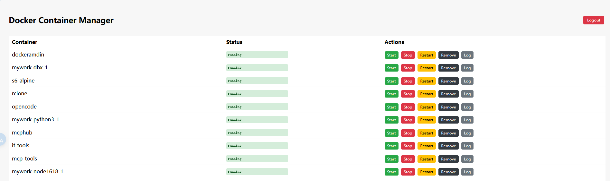
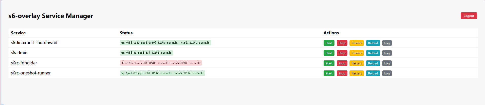

# cgi极简管理面板

一个基于 BusyBox HTTPD + Shell CGI 的极简管理面板

把对应服务`.cgi`文件放到`/var/run/cgi-bin`目录,通过`busybox httpd -v -f -p 33001 -h /var/run/`运行管理界面

## ✨ 功能特性

- 🔐 Cookie 认证登录：支持用户名/密码验证，默认凭据可通过环境变量自定义
- 📋 列表总览：实时展示所有容器名称及运行状态
- ▶️ 周期管理：一键 Start / Stop / Restart / Remove
- 📜 日志查看：新窗口查看最近 200 行日志，自动 HTML 转 转义
-🗑️安全删除保护：仅允许删除已停止状态的容器
- 📱 响应式界面：适配移动端与桌面端

## ⚙️ 配置说明

通过环境变量自定义登录凭据：

| 变量名 | 默认值 | 说明 |
|--------|--------|------|
| DOCKERADMIN_USER | admin | 登录用户名 |
| DOCKERADMIN_PASS | admin | 登录密码 |

- docker

- s6-overlay

